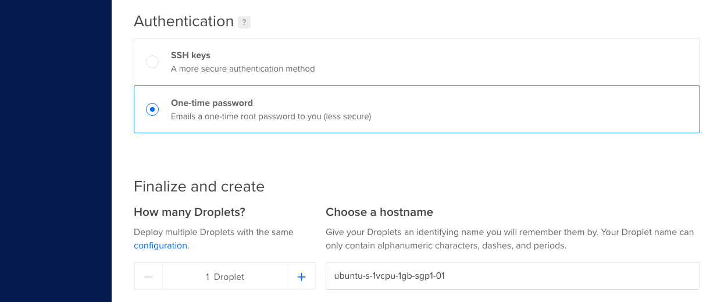
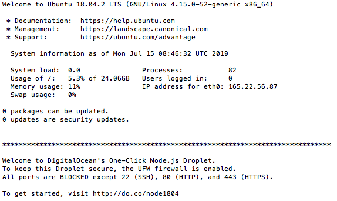

# Beforehand

1. Prepare a payment method - card or paypal

  (you will get free credits but the website registration will require those details)

# We will mainly look at
* DigitalOcean (2011)

Other

* Amazon Web Services (AWS)
* Heroku (2007)


1. Is NodeJS available
2. How difficult is it to set up
3. How much is the cost you have to pay
4. Can host database or not

# Obtain Remote Server

Goals:

1. Obtain Server
2. Get into Server - SSH


### 1. DigitalOcean Account, Free Credits

A. [Click here to enter DigitalOcean via this specific link](https://m.do.co/c/91c59e387330) to get the free credits for Digital Ocean for free access when you are learning NodeJS Express
```html
https://m.do.co/c/91c59e387330
```

B. Click on the Sign Up button

C. You will be brought to the next page.

Near the top, it should say:

<!--  -->


If you saw no such message, please ask someone for assistance right now:

  * Because without that message, the free credits will not come
  * Make sure you used the link above


### 2. Proceeding Into Your Email

A. Check your email

B. Click on the link inside the email

C. On the Payment Method Verification page, enter the details into the fields.

We are using the free credits. But Digital Ocean will still require those details.

- Note: See https://www.digitalocean.com/docs/accounts/billing/
  > "DigitalOcean bills in USD. To keep our pricing stable and consistent, rather than fluctuating with exchange rates, we do not bill in local currency. Similarly, we do not invoice in local currency. All invoices are in USD."
  - So it is best to use a US credit card (uses US dollars) *if you have one* - because we want to save and have less of international currency conversion fees
  - If you don't have one yet - you can follow the method below- [How to get a USD credit card when you are physically based outside of the USA](<#How-to-get-a-USD-credit-card-when-you-are-physically-based-outside-of-the-USA>)

D. Do not touch anything on this page. Do the next step now.


### 3. Free Credits!

A. [Click this link](https://cloud.digitalocean.com/account/billing) to see it!

B. It should show:

<!--  -->


### 4. Create Droplet

A. Create by using [this link - click here](https://cloud.digitalocean.com/droplets/new?appId=48826207&size=s-1vcpu-1gb)

B. Some options to set:

* Choose a datacenter region:
  - Singapore
* Authentication
  - SSH Keys `(My Best Practice)`
  - One-Time Password (Will use for just today)
* Finalize and create
  * How many Droplets?
    - 1 Droplet

<!--  -->


<!--  -->


About SSH Key: https://help.github.com/en/articles/generating-a-new-ssh-key-and-adding-it-to-the-ssh-agent


### 5. Open Details

A. See your email for the details on IP Address and Password.

eg 987.654.321.987


### 6. SSH
A. Jump onto the Command Line - the Terminal - again

B. Time to do the real SSH
```bash
#SSH
ssh root@987.654.321.987
```
After that, since we chose the Password method above, we will need to paste the password.


C. After you submit, you should see this:




### 7. Final

```bash
cd ~
git clone git@github.com:wdi-sg/express-basic.git
cd express-basic
npm install
npm start
```


### 8. `🚦(My Best Practice)🚦` - Server


 6. `🚦(My Best Practice)🚦`
```bash
echo '' >> ~/.bash_profile
echo '#Digital Ocean' >> ~/.bash_profile
echo 'digitalocean_addr=987.654.321.987' >> ~/.bash_profile
source ~/.bash_profile
```
```bash
echo alias oceanssh='ssh root@$digitalocean_addr' >> ~/.bash_profile
source ~/.bash_profile
```
```bash
#Time to do the real SSH
#SSH
#ssh root@987.654.321.987
ssh root@${digitalocean_addr} #Use This `🚦(My Best Practice)🚦`
#oceanssh                     #Useful but use the above for now `(Useful)`
```


 7. `🚦(My Best Practice)🚦`
```bash
adduser bossdog
```
Then
```bash
su - bossdog
```
Then
```bash
cd ~
git clone git@github.com:wdi-sg/express-basic.git
cd express-basic
npm install
npm start
```


 4. `🚦(My Best Practice)🚦`
```bash
#SSH Keys
ssh-keygen -t rsa -b 4096 -C "your_email@example.com"
```
It will be best [to read here](https://help.github.com/en/articles/generating-a-new-ssh-key-and-adding-it-to-the-ssh-agent)


